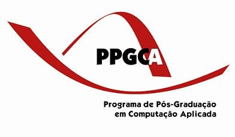

--- 
marp: true
size: 16:9
theme: default
paginate: true
backgroundColor: lightblue 
header: 'Programa de Pós-Graduação em Computação Aplicada (PPGCA) da UTFPR Curitiba'
footer: 'Adolfo Neto'
---

# Programa de Pós-Graduação em Computação Aplicada (PPGCA) da UTFPR Curitiba

Site: http://ppgca.ct.utfpr.edu.br
Email: ppgca-ct@utfpr.edu.br

 

---

# Roteiro

- Estrutura Geral do Programa: objetivos, perfil discente, etc.
- Corpo Docente
- Linhas e Grupos de Pesquisa
- Pontos fortes do programa
- Principais dificuldades enfrentadas
- Oportunidades de Parcerias do programa com o Fórum

---

# Estrutura Geral do Programa: objetivos, perfil discente, etc.

- qualificar recursos humanos na área de computação aplicada, para atender a demanda da região por profissionais qualificados em pesquisa, desenvolvimento tecnológico e inovação tecnológica;

- pessoas do mercado, em grande maioria não recém-formados

- 106 formados, 109 defesas
- 41 regulares, 13 especiais

---

# Corpo Docente

- 24 permanentes
- 3 colaboradores

---

# Linhas e Grupos de Pesquisa

- Engenharia de Software
- Visão Computacional e Reconhecimento de Padrões em Imagens
- Redes e Sistemas Distribuídos
- Sistemas Embarcados e Robótica
- Sistemas de Informação
- Sistemas Inteligentes e Lógica

---

# Pontos fortes do programa

- Articulação com extensão: [Cafezíneos](https://www.cafezineos.com/), [Emílias](https://www.instagram.com/emilias_utfpr/), [Fronteiras da Engenharia de Software](https://fronteirases.github.io/) 

---

# Principais dificuldades enfrentadas

- Evasão de estudantes (mesmo antes da pandemia)
- Atração de estudantes (menos de 1 candidato por vaga de regular)

---

# Oportunidades de Parcerias do programa com o Fórum

- Permissão de uso do StreamYard para a transmissão das palestras do Fórum
- Colaboração com outros programas da UTFPR em disciplinas

---

